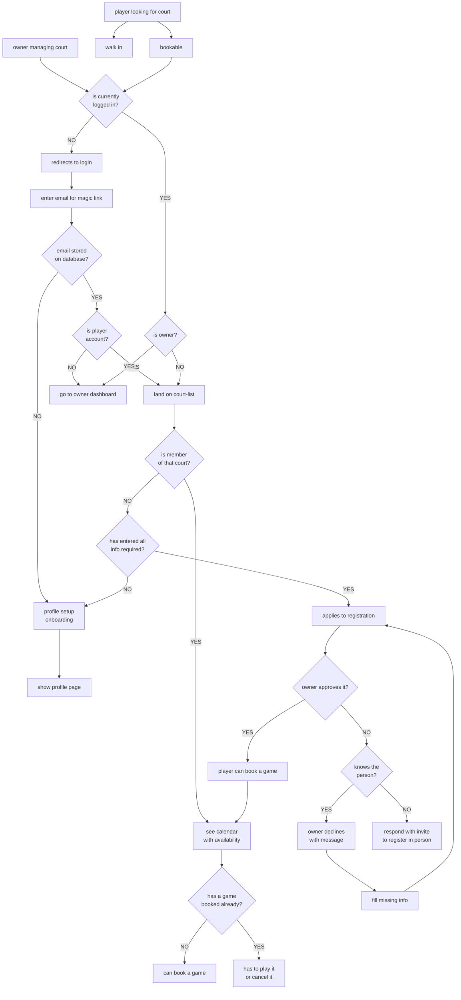

# Campo Livre — App Flows

## Player booking flow

```mermaid
flowchart TD
    Z[owner managing court] --> D
    A[player looking for court] --> B[walk in]
    A --> C[bookable]

    C --> D{is currently\nlogged in?}
    D -- NO --> F[redirects to login]
    F --> M[enter email for magic link]
    M --> N{email stored\non database?}
    N -- NO --> O[profile setup\nonboarding]
    O --> W[show profile page]
    N -- YES --> U{is player\naccount?}
    U -- YES --> P[land on court-list]
    U -- NO --> V[go to owner dashboard]

    D -- YES --> R{is owner?}
    R -- YES --> V
    R -- NO --> P
    P --> E{is member\nof that court?}

    E -- YES --> G[see calendar\nwith availability]
    G --> S{has a game\nbooked already?}
    S -- NO --> H[can book a game]
    S -- YES --> T[has to play it\nor cancel it]

    E -- NO --> Q{has entered all\ninfo required?}
    Q -- YES --> I[applies to registration]
    Q -- NO --> O
    I --> J{owner approves it?}

    J -- YES --> K[player can book a game]
    K --> G

    J -- NO --> X{knows the\nperson?}
    X -- YES --> L[owner declines\nwith message]
    L --> AA[fill missing info]
    AA --> I
    X -- NO --> Y[respond with invite\nto register in person]
```
